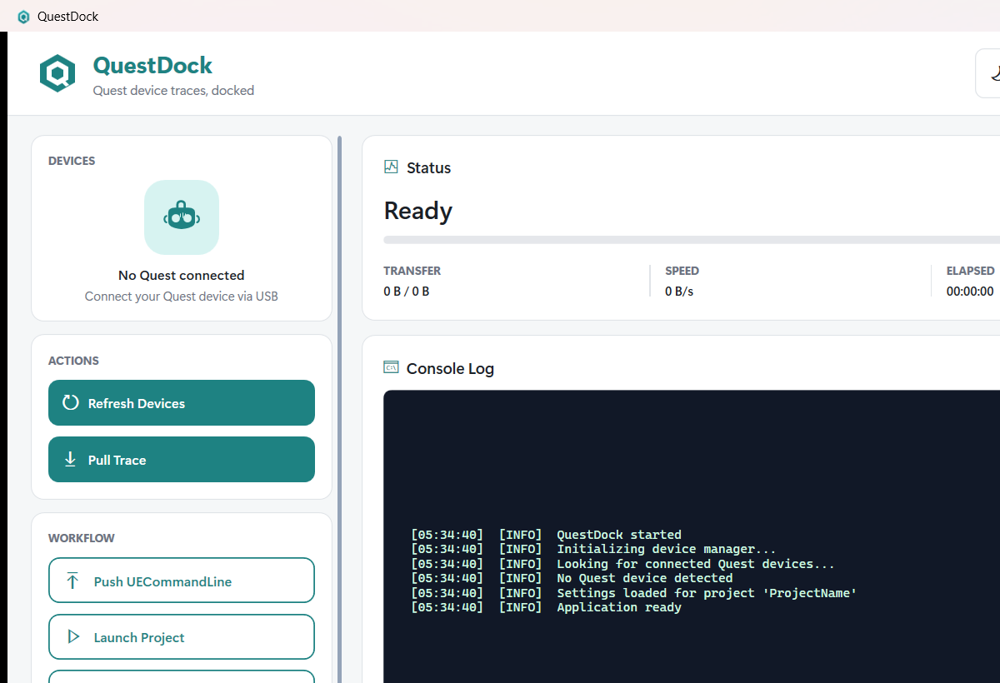
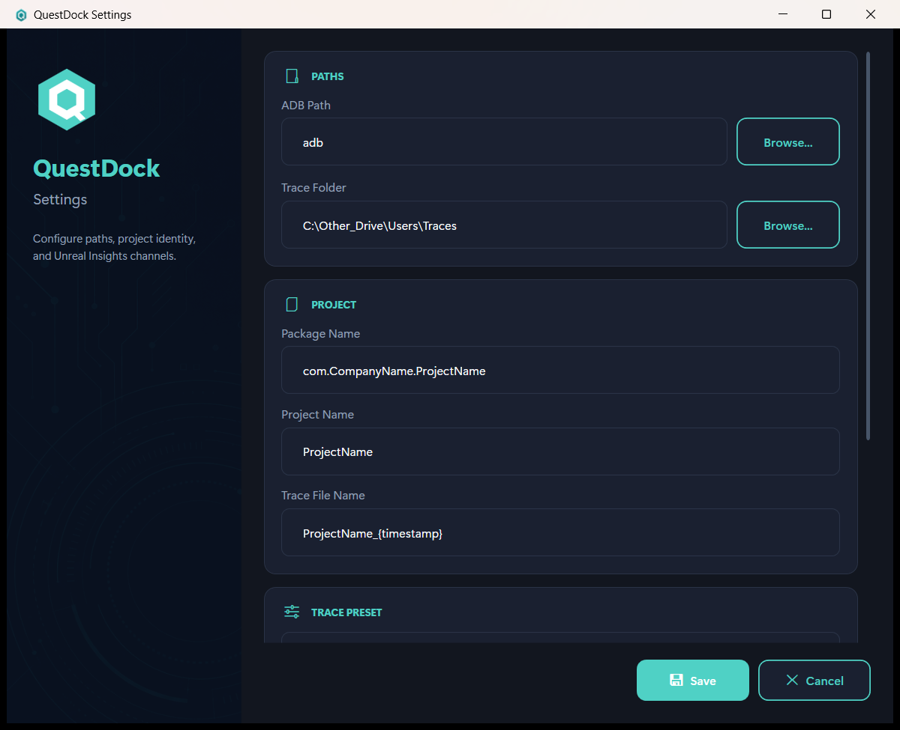
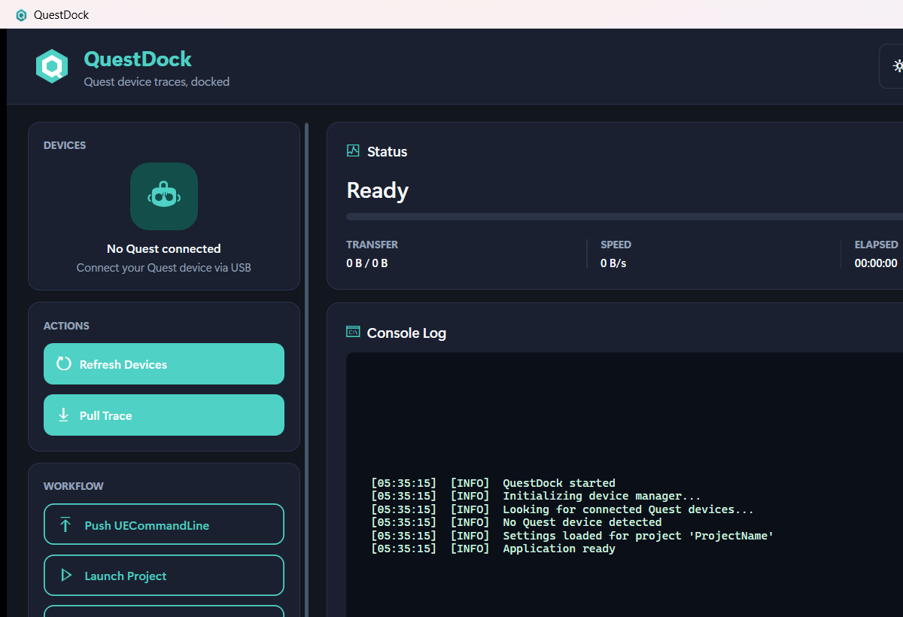

# QuestDock

**Developed by [Pratik Kuratkar](https://github.com/baymax-pratik)**

**Quest device traces, docked.**

QuestDock is a Windows desktop utility for Unreal Engine teams working on **Meta Quest**. It connects over ADB so you can manage headsets, push Unreal Insights command lines, launch your packaged app, and pull `.utrace` files back to your PC ? without juggling a pile of terminal commands.

<p align="center">
  
</p>

<p align="center">
  <a href="https://github.com/baymax-pratik/QuestDockApp/releases/latest"><strong>? Download latest release</strong></a>
</p>

---

## Why QuestDock?

Profiling Quest builds with Unreal Insights usually means:

- finding the right device serial  
- writing / pushing `UECommandLine.txt`  
- launching the package  
- pulling traces from device storage  
- keeping paths and presets consistent across the team  

QuestDock turns that into a single focused workflow with live status, transfer progress, and a clear activity log.

---

## Features

### Device management
- Refresh connected Quest / Android devices over ADB  
- See device serials in one place before you push or pull  

### Trace workflow
- **Push UECommandLine** ? generate Insights flags from your settings and push them to the device  
- **Launch Project** ? start the package configured in Settings on the headset  
- **Pull Trace** ? download the trace file with progress feedback in the log  
- **Open Trace Folder** ? jump straight to your local traces directory  
- **Delete UECommandLine** ? clean up when you are done  

### Settings & presets
Configure once, reuse every session:

- ADB path  
- Local trace folder  
- Package name & project name  
- Trace file name pattern  
- Trace presets (GPU / CPU / Performance / Memory / Networking / Full Trace / Custom)  
- Fine-grained channel toggles (CPU, GPU, Frame, Memory, Niagara, Stat Named Events, and more)

<p align="center">
  
</p>

### Modern UI
- Clean **Teal Technical** design  
- **Light** and **Dark** themes (toggle in the header; preference is saved)  
- Status, progress bar, transfer stats, and console-style log  

<p align="center">
  
</p>

---

## Install (Windows)

1. Open the latest [**Release**](https://github.com/baymax-pratik/QuestDockApp/releases/latest)  
2. Download **`QuestDock-win-x64.zip`**  
3. Unzip anywhere  
4. Run **`QuestDock.exe`**

This build is **self-contained** ? you do **not** need to install the .NET runtime separately.

> **Tip:** Ignore GitHub?s automatic ?Source code (zip/tar.gz)? links on the release page. Those only contain this README. Always download **`QuestDock-win-x64.zip`**.

---

## Requirements

| Item | Details |
|------|---------|
| OS | Windows 10 / 11 (64-bit) |
| Hardware | Meta Quest (or Android device) with USB debugging |
| Tools | [Platform Tools / ADB](https://developer.android.com/tools/releases/platform-tools) on your PC |
| Engine | Unreal Engine project set up for Insights / `UECommandLine` on device |

---

## Quick start

1. Enable **Developer Mode** and **USB debugging** on the Quest  
2. Connect the headset and authorize the PC  
3. Launch **QuestDock**  
4. Open **Settings** and set:  
   - **ADB Path** (e.g. `adb` if on PATH, or full path to `adb.exe`)  
   - **Package Name** of your Android build  
   - **Trace Folder** on your PC  
   - Trace options / preset you need  
5. Click **Refresh Devices** ? confirm your device appears  
6. **Push UECommandLine** ? **Launch** ? capture ? **Pull Trace**  
7. Open the local folder and load the trace in **Unreal Insights**

---

## Typical session

```text
Refresh Devices
    ? Push UECommandLine
        ? Launch application
            ? (play / repro on headset)
                ? Pull Trace
                    ? Open Trace Folder ? Unreal Insights
```

Use **Delete UECommandLine** when you want to remove the pushed command line from the device.

---

## Screenshots

| Light theme | Dark theme | Settings |
|:---:|:---:|:---:|
|  |  |  |

---

## Privacy & source

- **This repository (`QuestDockApp`)** is for **public downloads of the application only**.  
- Application **source code is not published here**.  

---

## Support

If something fails (device not listed, push/pull errors), check:

1. ADB path in Settings  
2. USB debugging authorized on the headset  
3. Package name / remote path match your packaged build  
4. The **Log** panel in QuestDock for the exact ADB output  

---

## Author / Developer

**Pratik Kuratkar** ([@baymax-pratik](https://github.com/baymax-pratik))

## License / distribution

Distributed as a compiled Windows application via GitHub Releases.  
? QuestDock maintainers.
